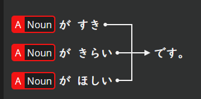
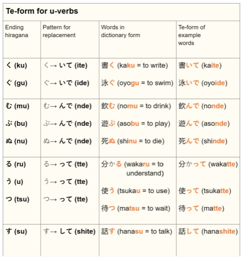

# です

| Positive      | がくせいです             |
| ------------- | ------------------ |
| Negative      | がくせい**じゃない**です     |
| Past          | がくせい**でした**        |
| Negative      | がくせい**じゃありません**    |
| Negative Past | がくせい**じゃありませんでした** |
- conjugate じゃない to past: drop い and add かった
# adj

## な-adj

| げんき（な）                 |             |                        |                   |
| ---------------------- | ----------- | ---------------------- | ----------------- |
| Negative(Casual)       | げんき**じゃない** | Negative (Polite)      | げんき**じゃありません**    |
| Past (Casual)          | げんき**だった**  | Past (Polite)          | げんき**でした**        |
| Negative Past (Casual) |             | Negative Past (Polite) | げんき**じゃありませんでした** |
| Te form(Linking adj)   | げんき**で**    | Negative Te form       | げんき**じゃなくて**      |
|                        |             |                        |                   |
|                        |             |                        |                   |
## い-adj

| あたらしい                  |               |                        |                   |
| ---------------------- | ------------- | ---------------------- | ----------------- |
| Negative(Casual)       | あたらし**くない**   | Negative (Polite)      | あたらし**くありません**    |
| Past (Casual)          | あたらし**かった**   | Past (Polite)          | あたらし**かったです**     |
| Negative Past (Casual) | あたらし**くなかった** | Negative Past (Polite) | あたらし**くありませんでした** |
| Te form(Linking adj)   | あたらし**くて**    | Negative Te form       | あたらし**くなくて**      |
|                        |               |                        |                   |

## Irregular

| いい（acts as if it were よい） |            |                        |                |
| ------------------------- | ---------- | ---------------------- | -------------- |
| Negative(Casual)          | よ**くない**   | Negative (Polite)      | よ**くありません**    |
| Past (Casual)             | よ**かった**   | Past (Polite)          | よ**かったです**     |
| Negative Past (Casual)    | よ**くなかった** | Negative Past (Polite) | よ**くありませんでした** |
| Te form(Linking adj)      | よ**くて**    | Negative Te form       |                |
|                           |            |                        |                |

## Like、dislike、want

- すき（like）: な-adj
- きらい（dislike）: な-adj
- ほしい（want）: い-adj
- だいすき（love）
- だいきらい（hate）
# Verb

## Verb stem
### Godan verbs
also known as a 'う verb' or 'u verb'
- Determine
  1. If the verb's dictionary form doesn't end in る
  2. If the vowel preceding the る is a/o/u
- Conjugation
  - Change the last character from it's 'u' form to the 'i' form.
### Ichidan verbs
- Determine
  - need to be memorized.
- Conjugation
  - Remove the る from the end of the verb.
### Special cases
1. する (to do) is changed to し.
2. くる (to come) is changed to き.
## Conjugation

| Verb stem: vs |        |               |           |
| ------------- | ------ | ------------- | --------- |
| Positive      | vs+ます  | Negative      | vs+ません    |
| Past          | vs+ました | Negative Past | vs+ませんでした |
## て form
- ichidan verbs: remove る and add て
- special cases:
	- する: して
	- くる: きて
- godan verbs:
  